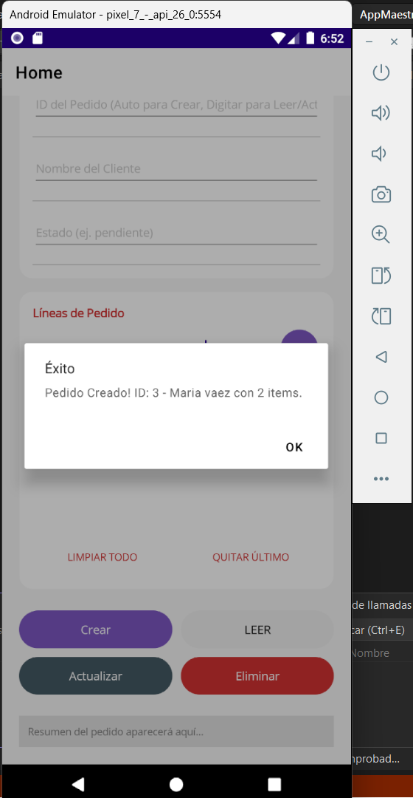
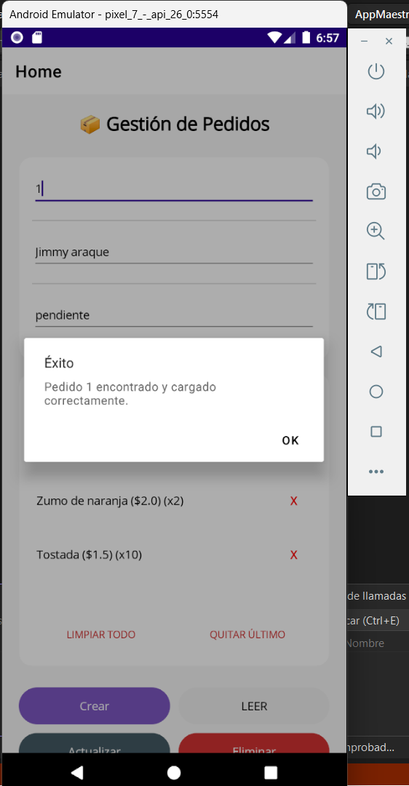
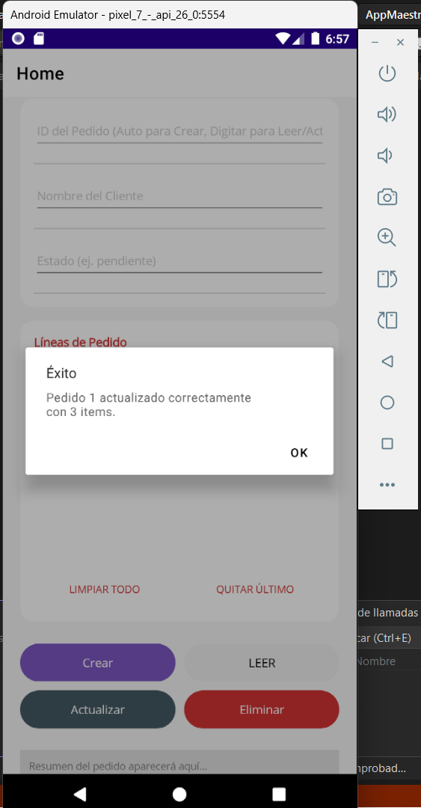
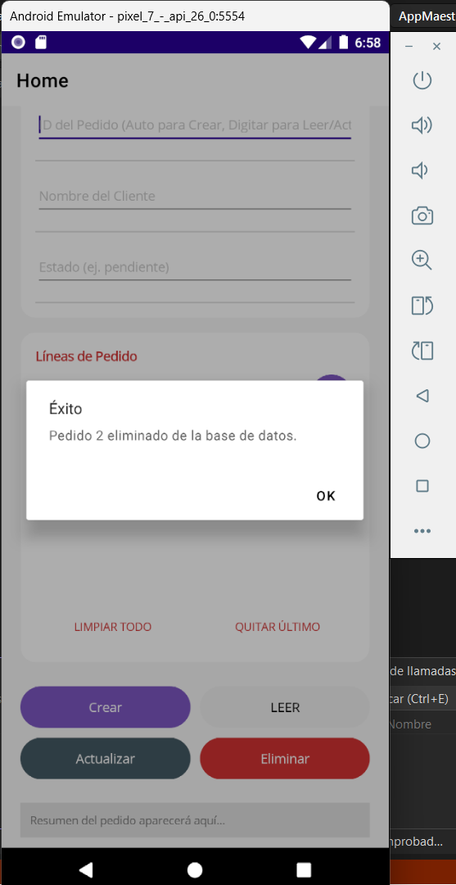

# App Gestión de Pedidos (Maestro/Detalle) con SQLite en .NET MAUI

Este proyecto es un ejemplo práctico de cómo implementar una interfaz Maestro/Detalle en una sola pantalla utilizando .NET MAUI y SQLite (a través de Dapper). El diseño está fuertemente inspirado en una interfaz de gestión rápida, donde puedes construir el detalle de forma temporal en memoria antes de afectar la base de datos.

## Características

- **Patrón Maestro/Detalle:** Gestión de dos tablas relacionadas (Pedidos y LíneasPedido).
- **Construcción en Memoria:** Vas añadiendo productos a una lista visual y solo cuando presionas "Crear" o "Actualizar", se refleja en la base de datos de una sola vez.
- **Base de datos Local:** Uso de Microsoft.Data.Sqlite para almacenamiento local.
- **Micro ORM:** Uso de Dapper para ejecutar consultas SQL de forma rápida.
- **Diseño Limpio:** Uso de un diseño con tarjetas (Frames) esquinas redondeadas e iconos para una vista más amigable.

## Operaciones CRUD

La aplicación permite realizar las cuatro operaciones básicas de gestión de datos directamente desde una única interfaz. Cada operación está diseñada para ser intuitiva y proporciona retroalimentación visual inmediata al usuario.

### Crear (Create)

La operación de creación permite registrar nuevos pedidos en el sistema. Para crear un pedido, el usuario debe completar los campos del formulario principal con la información del cliente y el estado del pedido, añadir las líneas de producto deseadas utilizando los controles de gestión de productos, y finalmente presionar el botón "Crear" para persistir toda la información en la base de datos de una sola vez. El sistema genera automáticamente el identificador del pedido y muestra una notificación de confirmación con el ID asignado.

### Leer (Read)

La operación de lectura permite consultar pedidos existentes en la base de datos. El usuario debe ingresar el identificador del pedido en el campo correspondiente y presionar el botón "LEER" para recuperar la información completa, incluyendo el nombre del cliente, el estado actual y todas las líneas de productos asociadas. La aplicación carga automáticamente todos los datos en el formulario, permitiendo al usuario revisar los detalles del pedido seleccionado.

### Actualizar (Update)

La operación de actualización permite modificar pedidos existentes. Para actualizar un pedido, el usuario primero debe leer el pedido que desea modificar utilizando la operación de lectura, realizar los cambios deseados en los campos del formulario o en las líneas de productos, y presionar el botón "Actualizar" para guardar los cambios. El sistema procesa la actualización y confirma mediante una notificación que incluye la cantidad de elementos actualizados.

### Eliminar (Delete)

La operación de eliminación permite borrar pedidos de la base de datos. El usuario debe ingresar el identificador del pedido que desea eliminar y presionar el botón "Eliminar" para ejecutar la operación. El sistema solicita confirmación antes de proceder y muestra una notificación de éxito indicando que el pedido ha sido eliminado correctamente de la base de datos.

## Cómo Ejecutar

1. Clona o descarga este repositorio.
2. Abre la solución en Visual Studio.
3. Restaura los paquetes NuGet.
4. Ejecuta la aplicación en tu emulador Android o en Windows Machine.

